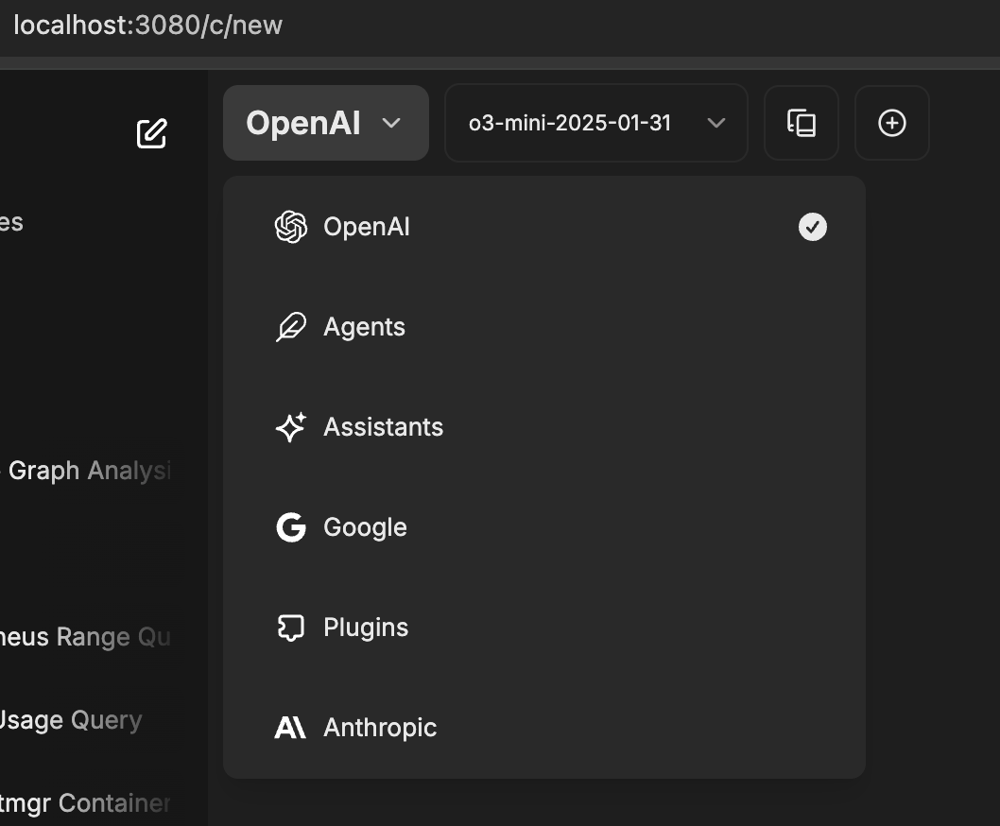
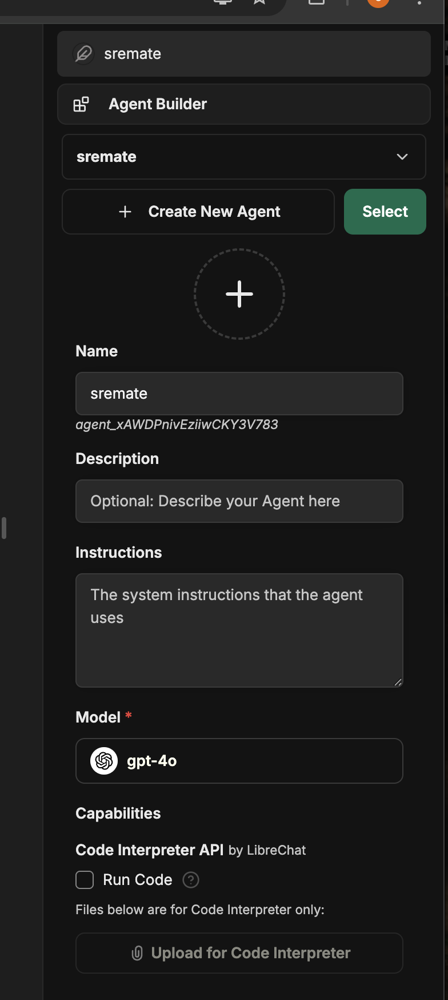
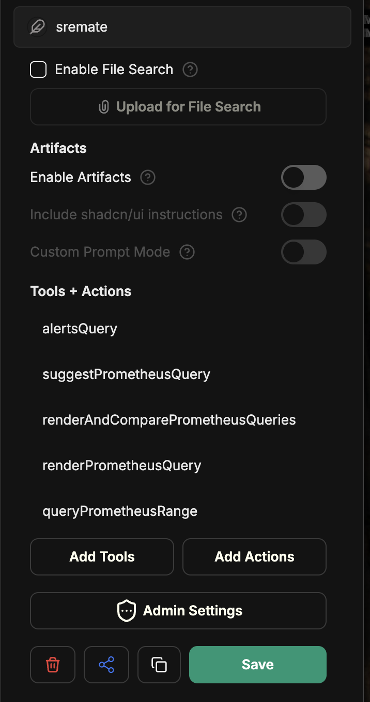
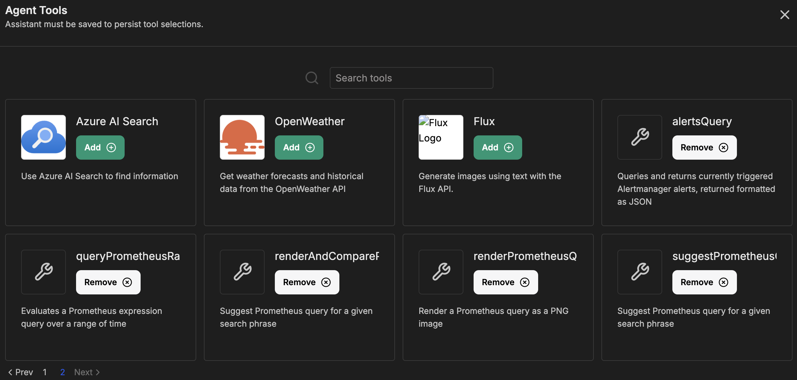

# MCP Server
MCP server for Chronosphere. Serves tools for fetching logs, metrics, traces, events as well as select entities.

This project is a work in progress. Many features are not yet implemented and features may be added, changed or removed without warning.

## Prototyping/manual testing with libra chat
Prototyping with an agentic assistant experience for SRE and observability tasks
using:
- [LibreChat](https://github.com/danny-avila/LibreChat) to test interactions
- [Goose](https://github.com/block/goose) to test agentic behavior with .goosehints
- [LlamaIndex agents](https://docs.llamaindex.ai/en/stable/examples/agent/agent_runner/agent_runner_rag_controllable/) to provide guidance to agentic behavior

## Agent
The agent is currently copied from a template. It doesn't do much yet, but we plan to use it for testing and building some examples of agentic behavior using the server.

## Developing
### Running the server
#### Authentication to Chronosphere

This MCP server uses the same authentication methods as chronoctl. By default, the Makefile expects the API token to be stored in `.chronosphere_api_token`.

Alternatively, set `useLoopback: true` in config.yaml to use a fake loopback Prometheus server.


#### Run the mcp server
```sh
make run-server
```

### Running the host client (libre chat)
#### Set up the env file
Copy .env.example to .env, and edit according to the two TODOs:
- Add an API key for a llm you want to use e.g. OPENAI_API_KEY
- Run the following, replacing `CREDS_KEY` and `CREDS_IV` respectively:
```
python3 -c 'import os; print(os.urandom(32).hex(), os.urandom(16).hex())'
```

#### Run the host client
```sh
make run-client
```
NOTE: the server needs to be running for the client to find the tools, so run the server first.

#### Open libra chat
Open this in your browser http://localhost:3080/

The first time you run it, you'll need to create an account. All your info is stored locally in a mongo db server
as part of libra chat.

#### Create a new agent in libra chat
Select Agents from the drop down



Create an agent (give it a name, select model, etc)



Add tools



Select the tools the agent can use.



If you don't see the tools defined in the mcp server, make sure the server is running and restart libra chat

```sh
docker-compose down
docker-compose up -d
```

### Debugging MCP Tools

The MCP project provides an inspector useful for directly calling tools APIs. To use:

1. Change baseURL in config.yaml to be 0.0.0.0/sse instead of docker
1. Run `npx @modelcontextprotocol/inspector node build/index.js`.
1. Open http://127.0.0.1:6274/#resources , fill in `http://0.0.0.0:8080/sse` in the URL, with transport type SSE.

## Using the Agent
To use the agent, first create a YAML file `agent.yaml`:

```
agent:
  openAIAPIKey: your-api-key
```

Then you can run:

```
make run-agent
```

with the MCP server running at 0.0.0.0:8080.

To augment the inputs that are provided to the model, edit `agent/resources/inputs.txt`; each non-blank line will correspond to a separate question to the agent.
