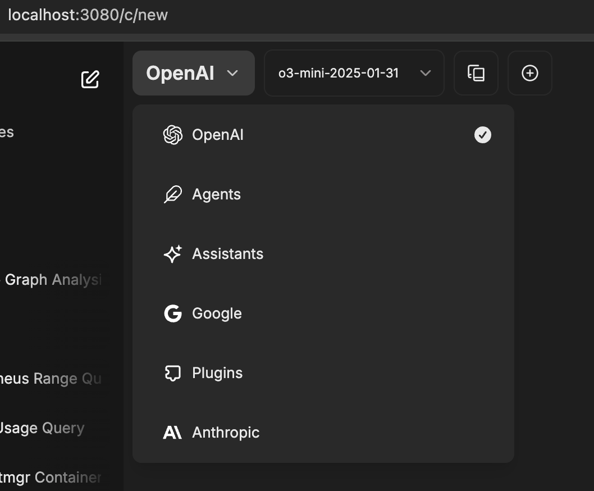
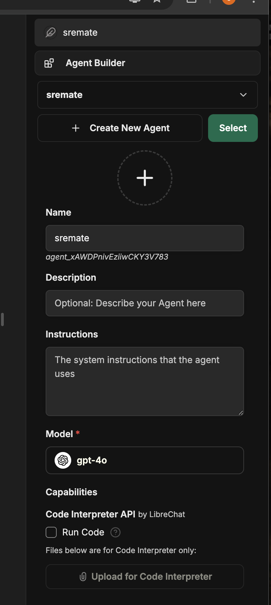
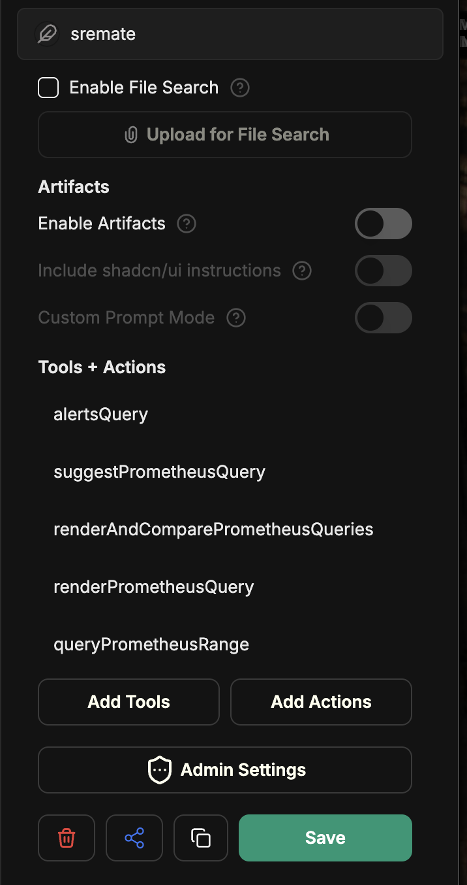
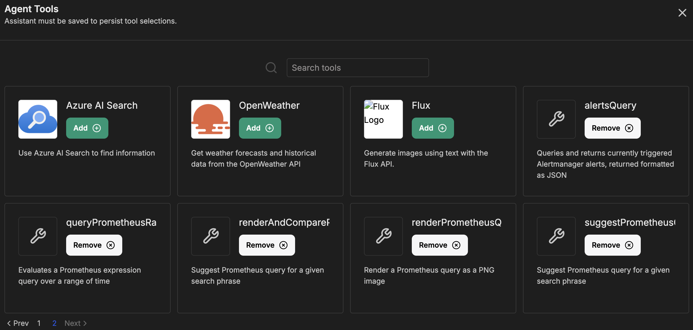

Prototyping with an agentic assistant experience for SRE and observability tasks
using:
- [LibreChat](https://github.com/danny-avila/LibreChat) to test interactions
- [Goose](https://github.com/block/goose) to test agentic behavior with .goosehints
- [LlamaIndex agents](https://docs.llamaindex.ai/en/stable/examples/agent/agent_runner/agent_runner_rag_controllable/) to provide guidance to agentic behavior

### Running the host client (libre chat)
#### Set up the env file
Copy .env.example to .env, and edit according to the two TODOs:
- Add an API key for a llm you want to use e.g. OPENAI_API_KEY
- Run the following, replacing `CREDS_KEY` and `CREDS_IV` respectively:
```
python3 -c 'import os; print(os.urandom(32).hex(), os.urandom(16).hex())'
```

#### Run the host client
```sh
make run-chat
```
NOTE: the server needs to be running for the client to find the tools, so run the server first.

#### Open libra chat
Open this in your browser http://localhost:3080/

The first time you run it, you'll need to create an account. All your info is stored locally in a mongo db server
as part of libra chat.

#### Create a new agent in libra chat
Select Agents from the drop down



Create an agent (give it a name, select model, etc)



Add tools



Select the tools the agent can use.



If you don't see the tools defined in the mcp server, make sure the server is running and restart libra chat

```sh
docker-compose down
docker-compose up -d
```
